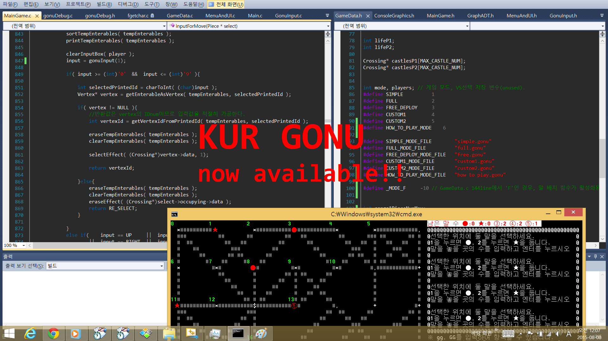

# KUR-GONU

my first c console game

## Summary
학부생 1학년 1학기 여름 방학. **그냥 심심해서** 학기 중에 배운 C로 콘솔 TUI 게임을 만들었습니다. \
과제도 아니고 누가 시키지도 않았으나 그냥 만들고 싶어서 **방학 한 달 반**을 투자하여 **혼자 힘으로 완성**하였습니다.

다른 계산 없이 가장 순수하게 재미로만 만든 작품이기에 올렸습니다. \
(윈도우 8에서 제대로 작동하며, 윈도우 10에서는 콘솔 출력에 버그가 있습니다)

이 레포를 통해 알 수 있는 것
- 이 사람 진짜 프로그래밍 좋아하는구나..

[프로젝트 폴더](./KUR%20GONU)에서 1학년 학부생이었던 제가 이 프로그램을 만들기 위해 했던 삽질을 확인할 수 있습니다
- [게임 명세서 구버전](./KUR%20GONU/KUR%20고누%20명세서_구버전.pdf)
- [개발 일지](./KUR%20GONU/고누%20개발%20다이어리.txt)
